# **ODIS – Creare una pausa lunga usando Loop + **

# **Message**

# **Obiettivo**

In ODIS non è pratico usare i classici *wait* in millisecondi per pause lunghe (minuti).

La soluzione corretta è usare un **Loop con Timeout** e, opzionalmente, un **Message** per informare

l’operatore del tempo di attesa.

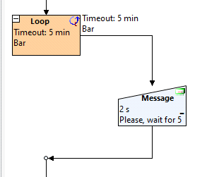

# **Concetto base**

Per creare una pausa lunga (es. 3 o 5 minuti):

si utilizza un **Loop**

- il Loop viene configurato con **Timeout in secondi o minuti**

- opzionalmente si abilita la **Bar** per mostrare il tempo che passa

- si aggiunge un **Message** per visualizzare un messaggio all’utente

- Questo metodo è stabile, leggibile e pensato proprio per attese lunghe.

# **Step 1 – Aggiungere un Loop**

All’interno del test plan, **clic destro** nel punto desiderato

1.

Seleziona:

2.

New action element → Dialog → Loop

*Nell’immagine si vede il menu contestuale con “Dialog → Loop” selezionato.*

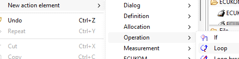

# **Step 2 – Configurare il Loop (Timeout)**

Si apre la finestra **Loop dialog**.

# 15.1 Code a pause (loop)

tutorials Page 1

---

Impostazioni consigliate:

**Type**: Timeout

- **Valore**:

es. 3 min oppure 5 min

- **Unità**: sec o min

- ✅**Bar** → opzionale, ma consigliata per mostrare il tempo che passa

- *Nell’immagine si vede chiaramente la sezione “Timeout” con l’opzione “Bar” selezionabile.*

✅Conferma con **OK**.

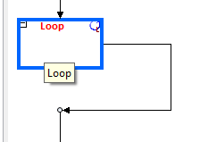

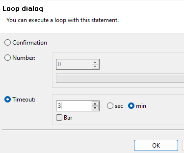

# **Step 3 – Verifica visiva del Loop**

Dopo la conferma, il Loop appare nel test plan con un’etichetta simile a:

Loop

Timeout: 3 min

*Nell’immagine il riquadro del Loop mostra “Timeout: 3 min” nella parte superiore.*

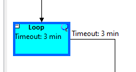

# **Step 4 – Aggiungere un Message (consigliato)**

Per informare l’operatore durante l’attesa, aggiungiamo un messaggio.

## **Inserimento del Message**

**Clic destro all’interno del Loop**

**1.**

Seleziona:

2.

New action element → Dialog → Message

tutorials Page 2

---

*Nell’immagine si vede il menu con “Message” evidenziato sotto la categoria Dialog.*

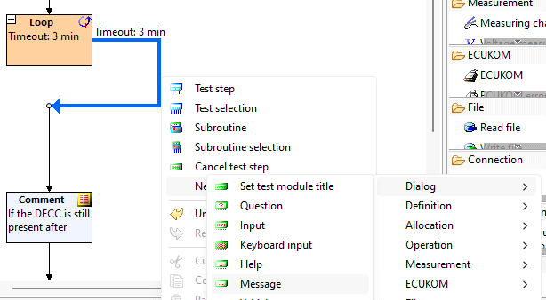

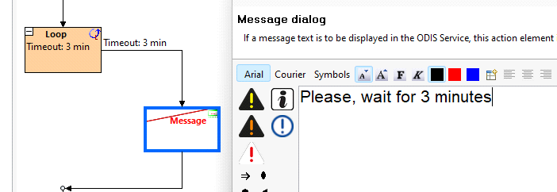

# **Step 5 – Configurare il Message**

Nella finestra **Message dialog**:

## **Campo Text**

Inserisci ad esempio:

Please, wait for 3 minutes

## **Impostazioni suggerite**

**Confirmation**: No

- **Bar**: No

- **Waiting time**: 2 seconds

(tempo di visualizzazione del messaggio, non legato al Loop)

- *Nell’immagine è visibile il testo “Please, wait for 3 minutes” e le opzioni di configurazione inferiori.*

Conferma con **OK**.

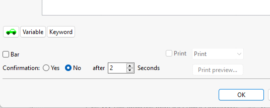

# **Risultato finale**

La logica finale è:

Il **Message** informa l’utente

1.

tutorials Page 3

---

Il **Loop** mantiene l’attesa per il tempo definito

2.

Se abilitata, la **Bar** mostra il progresso del tempo

3.

*Nell’ultima immagine si vede il Message collegato visualmente al Loop con Timeout.*

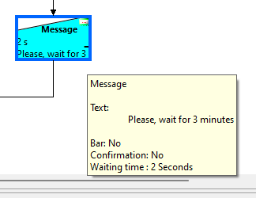

# **Note importanti**

✅Il **tempo reale di attesa** è determinato **solo dal Loop**

✅Il **Message NON blocca il tempo**, serve solo per informare

✅Questo metodo è ideale per:

riscaldamenti

- stabilizzazioni

- tempi di attesa operativi

- procedure di sicurezza

- tutorials Page 4

---

# **Tutorial – Mettere una funzione / oggetto in **

# **Risk Release tramite Order Management**

# **Scopo**

Questo tutorial descrive come portare una **funzione o oggetto** allo stato **Risk Released** tramite

**Order Management**, partendo da un determinato **ordine (context)**.

La procedura può essere eseguita:

✅come **Complete + Risk Release**

- ✅oppure come **Finished and Released** (in un unico passaggio)

- Viene inoltre spiegato come risolvere l’errore più comune legato al **version comment mancante**.

# **Prerequisiti**

Accesso a **Order Management**

- Oggetto/funzione assegnato a un ordine (order)

- Contesto selezionato (es. 2025.09.00)

- **Navigazione iniziale**

Aprire **Order Management**

1.

Navigare in:

2.

Order Management >> Orders

3. Selezionare l’**ordine (aka context)** desiderato

*Esempio: 2025.09.00*

Questo contesto determina **dove** verrà eseguita la complete / release.

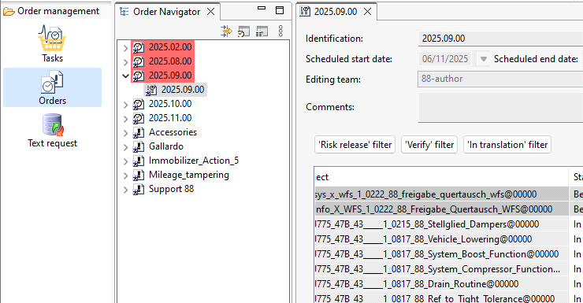

# **Caso 1 – Complete + Risk Release (step separati)**

## **Step 1 – Complete**

Nell’elenco oggetti dell’ordine:

selezionare la funzione / oggetto interessato

- 1.

Click destro

2.

Selezionare:

3.

Complete

# 2.3 Risk Release tramite Order Management

martedì 21 aprile 2026

16:26

tutorials Page 5

---

Lo stato dell’oggetto diventa **In Progress** → **Being completed**.

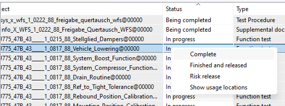

## **Step 2 – Risk Release**

Selezionare di nuovo l’oggetto completato

1.

Click destro

2.

Selezionare:

3.

Risk release

Se **non ci sono errori**, lo stato passa a **Risk released**.

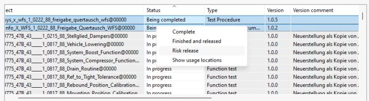

# **Caso 2 – Finished and Released (un solo step)**

In alternativa, è possibile completare e rilasciare in un’unica operazione.

In **Order Management >> Orders**

1.

Selezionare l’ordine (es. 2025.09.00)

2.

Selezionare l’oggetto

3.

Click destro

4.

Selezionare:

5.

Finished and released

✅Questo comando esegue automaticamente **Complete + Risk Release** in un solo passaggio.

# **Errore comune – Version comment mancante**

Durante la **Risk Release** può comparire il seguente errore:

Errors occurred for the editorial objects.

The above function is missing the version comment.

Therefore the risk release was not possible.

Questo significa che **la funzione non ha un Version Comment valorizzato**.

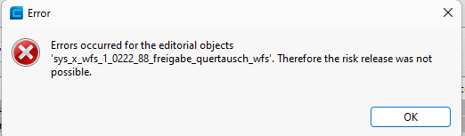

# **Risoluzione dell’errore**

tutorials Page 6

---

## **Step 1 – Aprire l’oggetto**

Fare **double-click sul link dell’oggetto** indicato nel messaggio di errore

1.

Si apre la finestra di dettaglio della funzione.

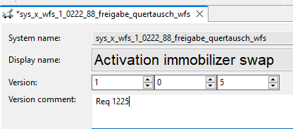

## **Step 2 – Aggiungere il Version Comment**

Individuare il campo:

1.

Version comment

2. Inserire un commento valido

*(esempio: riferimento ticket, change request, short description)*

Salvare

3.

Dopo il salvataggio, **lo stato della funzione torna a “In progress”**

Questo è **atteso e corretto**.

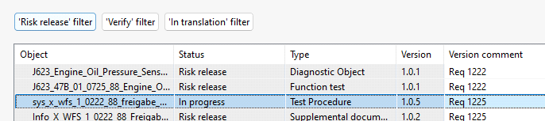

# **Ripetere Complete + Risk Release**

Dopo aver aggiunto il Version Comment:

Tornare in:

1.

Order Management >> Orders

2. Selezionare nuovamente l’ordine (es. 2025.09.00) 3. Eseguire **di nuovo**: * **Complete**, poi **Risk **

**release** * **OPPURE** direttamente **Finished and released**

✅Questa volta la Risk Release va a buon fine.

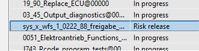

# **Stato finale atteso**

Al termine della procedura corretta:

la funzione risulta **Completed**

- la funzione risulta **Risk released**

- il **Version comment** è valorizzato e tracciabile

- **Note operative importanti**

❗**Risk Release fallisce sempre** se il Version Comment è vuoto

- ✅L’uso di **Finished and released** è consigliato quando:

non sono necessari step intermedi

- tutorials Page 7

---

il Version Comment è già presente

- Dopo aver corretto il Version Comment è **sempre necessario rifare Complete + Risk **

**Release**

- Se vuoi, al prossimo passo posso:

trasformare questo testo in **PDF strutturato come manuale interno**

- fare una **versione inglese “process compliant”**

- aggiungere una **tabella stati → azioni consentite**

- adattarlo a **linee guida audit / quality**

- From <https://m365.cloud.microsoft/chat/conversation/722755fe-a1d9-44eb-8770-4fe50fbab0b7>

tutorials Page 8

---

# **Tutorial – Creare un nuovo Diagnostic Object in **

# **Knowledge Base**

# **Scopo**

Questo tutorial descrive la procedura per creare un **nuovo Diagnostic Object** all’interno della

**Knowledge Base**, partendo dalla struttura di navigazione corretta e compilando i campi

obbligatori dell’oggetto.

# **Prerequisiti**

Accesso all’ambiente di authoring

- Visibilità della **Knowledge base**

- Nodo corretto già esistente (Function test / Diagnostic Object container)

- **Step 1 – Accedere alla Knowledge Base**

Aprire il tool

1.

Nel pannello di sinistra selezionare:

2.

Editing → Equipment Network → Knowledge base

3. Aprire il tab **Knowledge base navigator**

Qui viene visualizzata la struttura ad albero con:

domini

- sottosistemi

- funzioni

- oggetti diagnostici esistenti

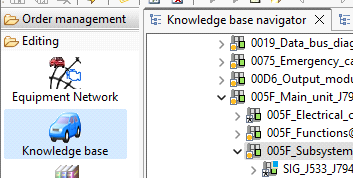

- **Step 2 – Selezionare il nodo corretto**

All’interno della Knowledge Base:

Navigare fino al **Function test** o al nodo funzionale corretto

(es. sottosistema, funzione, logical grouping)

1.

Posizionarsi **esattamente nel punto** in cui il nuovo Diagnostic Object deve essere creato

2.

Importante: la posizione nell’albero determina la corretta associazione funzionale.

# 3.1 New Diagnostic Object in Knowledge base

martedì 21 aprile 2026

16:31

tutorials Page 9

---

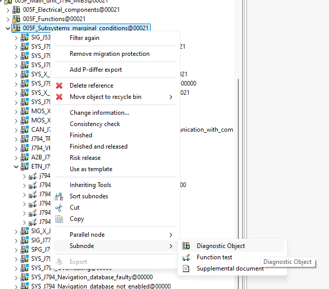

# **Step 3 – Creare il nuovo Diagnostic Object**

Click destro sul nodo selezionato

1.

Dal menu contestuale scegliere:

2.

Subnode →

Diagnostic Object

Questa azione apre la finestra di creazione del nuovo oggetto.

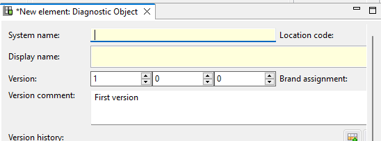

# **Step 4 – Compilare la finestra “New element: **

# **Diagnostic Object”**

Nella finestra **New element: Diagnostic Object** compilare i campi come segue.

## **Campi principali**

**System name**

Nome tecnico univoco (seguire naming convention di progetto)

- **Display name**

Nome leggibile per l’utente / diagnostico

- **Version**

Major / Minor / Patch secondo standard interno

- Tipicamente: 1.0.0

- tutorials Page 10

---

**Version comment**

Obbligatorio

- Inserire un commento descrittivo, ad esempio: First version

- **Location code**

Se richiesto dal progetto / contesto

- **Brand assignment**

Selezionare il brand appropriato (se applicabile)

- **Step 5 – Salvare il Diagnostic Object**

Confermare con **OK** o **Save**

1.

Il Diagnostic Object viene creato e inserito nell’albero della Knowledge Base

2.

Stato iniziale tipico:

**In progress**

- **Risultato atteso**

Alla fine della procedura:

il **Diagnostic Object è visibile nel Knowledge base navigator**

- l’oggetto è correttamente posizionato nel nodo selezionato

- System name, Display name e Version comment sono valorizzati

- l’oggetto è pronto per:

completamento contenuti

- collegamenti diagnostici

- successive fasi di complete / release

- **Note operative importanti**

❗Il **Version comment è obbligatorio**

Senza di esso, operazioni successive (complete / risk release) falliranno

- ✅Verificare sempre di creare l’oggetto **nel nodo corretto**

- ✅Usare naming coerente con:

funzione

- sottosistema

- progetto / contesto

- tutorials Page 11

---

# **Tutorial – Creare una TBL (Test Baseline)**

# **Scopo**

Questo tutorial descrive **come creare una nuova Test Baseline (TBL)**.

La particolarità della procedura è che **la TBL viene creata automaticamente salvando la **

**pagina**, senza conferme esplicite o pulsanti “OK”.

# **Prerequisiti**

Accesso a **ODIS Creator**

- Selezione dell’anno / contesto corretto (es. 2025)

- Permessi per **Test baselines**

- **Step 1 – Accedere a Test baselines**

Aprire **ODIS Creator**

1.

Nel pannello sinistro navigare in:

2.

Editing → Provision → Test baselines

3. Si apre il **Baseline browser**

Nel riquadro centrale è visibile:

il brand (es. *Lamborghini*)

- l’anno (es. *2025*)

- eventuali TBL già esistenti (es. Test_Full_Lambo_500.37.16)

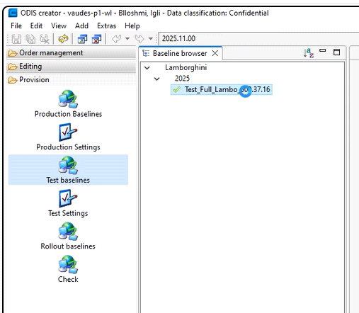

- 8.0 New TBL (Test Baseline)

martedì 21 aprile 2026

16:41

tutorials Page 12

---

# **Step 2 – Click su spazio vuoto**

Nel **Baseline browser**

1.

Fare **click su uno spazio vuoto**

(non su una baseline esistente, non sull’anno, non sul brand)

2.

✅Dopo il click appare il pulsante:

Create baseline

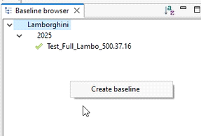

# **Step 3 – Create baseline**

Cliccare su **Create baseline**

1.

Si apre una nuova scheda:

2.

Test_Full_Lambo_<Version>

Questa è la **pagina della nuova TBL** in fase di creazione.

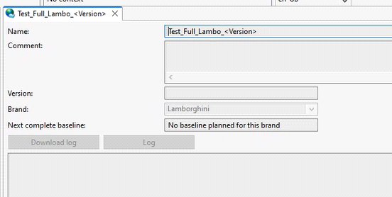

# **Step 4 – NON cliccare su niente**

Punto fondamentale

Nella pagina della nuova TBL:

❌**NON** cliccare su altri oggetti

- ❌**NON** cambiare selezione nel browser

- ✅**Chiudere la pagina salvando**

- Il sistema **crea la TBL proprio in questo momento**, senza ulteriori azioni.

tutorials Page 13

---

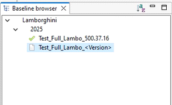

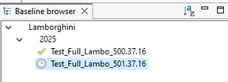

# **Step 5 – Verifica creazione TBL**

Dopo aver chiuso la pagina **con salvataggio**:

Tornare al **Baseline browser**

1.

Sotto: Lamborghini → 2025

2.

Compare una **nuova TBL** nell’elenco, ad esempio:

3.

Test_Full_Lambo_<Version>

Questa è la TBL appena creata.

# **Mentre va avanti (versionamento automatico)**

Proseguendo con il lavoro e le successive operazioni:

la TBL può passare automaticamente a una versione numerata, ad esempio:

Test_Full_Lambo_501.37.16

- il cambio di versione è gestito dal sistema in base allo stato e alle modifiche

- ✅Questo comportamento è corretto e previsto.

# **Risultato finale atteso**

Alla fine della procedura:

la **Test Baseline è visibile nel Baseline browser**

- la TBL è associata all’anno corretto

- la baseline è pronta per:

popolamento

- complete

- successive fasi di rilascio

- **Note operative importanti**

❗**La TBL NON viene creata cliccando “Create baseline” + OK**

- ✅La creazione avviene **solo chiudendo e salvando la pagina**

- ❗Cliccare altrove prima del salvataggio può **interrompere la creazione**

- ✅Verificare sempre la presenza della nuova TBL nel browser

- tutorials Page 14

---

# **TUTORIAL – Creare e rilasciare un Hotfix **

# **(con regola n-1)**

# **Scopo**

Questo tutorial descrive **come creare un hotfix tramite Order Management**, generarlo

correttamente, recuperare il nome del pacchetto e **comunicare il rilascio via Teams**,

tenendo conto della **regola n-1 sul periodo**.

# **Prerequisiti**

Accesso a **Order Management**

- Permessi per Hotfix

- Team corretto selezionabile

- Accesso alla cartella condivisa hotfix

- Chiarezza sul **periodo di rilascio target**

- ** Regola fondamentale –  eriodo n  **

**Regola fissa:**

**L’hotfix va sempre creato nel periodo n-1 rispetto al rilascio.**

## **Esempio**

Se stiamo rilasciando la **09 **

l’hotfix **VA MESSO NELLA 08**

- Questa regola è **obbligatoria** e non dipende dal contenuto dell’hotfix.

# **Step 1 – Accedere a Orders**

Aprire **Order Management**

1.

Navigare in:

2.

Order management → Orders

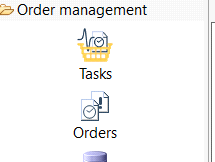

3. Selezionare **il contesto n-1** * esempio: * rilascio target: 2025.09.00 * **ordine da usare **

**per l’hotfix: 2025.08.00**

✅Questo è il contesto corretto per creare l’hotfix.

# 9.0 New Hotfix

martedì 21 aprile 2026

16:48

tutorials Page 15

---

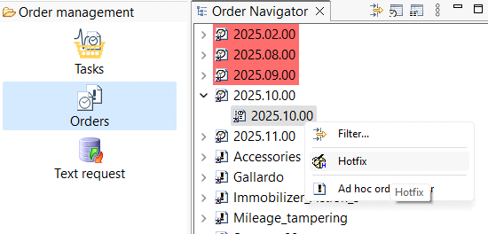

# **Step 2 – Selezionare il team**

Alla richiesta di selezione team:

Selezionare il team corretto

*(es. BB-author / team di riferimento)*

1.

Confermare

2.

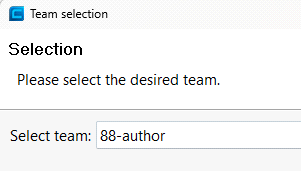

# **Step 3 – Selezionare e trascinare l’oggetto**

Nell’elenco degli oggetti dell’ordine:

individuare l’oggetto da includere nell’hotfix

- 1.

**Selezionare l’oggetto**

**2.**

**Trascinarlo nella finestra Hotfix**

**3.**

✅L’oggetto compare nella lista hotfix.

tutorials Page 16

---

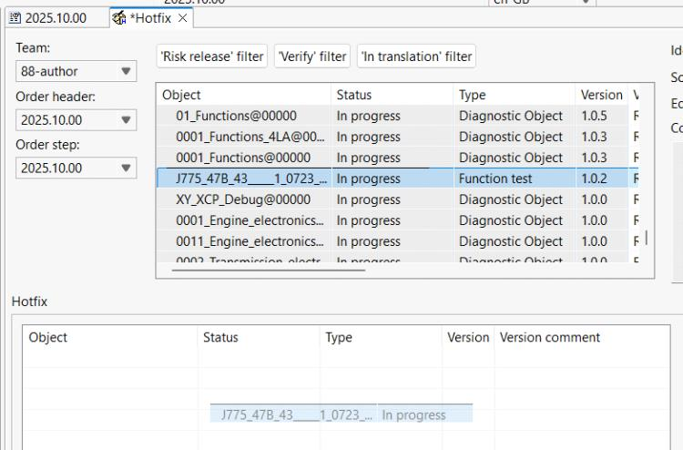

# **Step 4 – Compilare i dati Hotfix**

## **Identification**

**hfx è OBBLIGATORIO**

- Il resto può essere descrittivo

- ✅consentito (e consigliato) usare il **REQ**

- **Esempio:**

hfx_req1236_fix_activation_issue

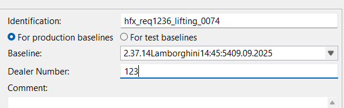

## **Deal Number**

❗**SEMPRE:**

- 123

Non usare altri valori.

## **Altri campi**

Lasciare di default se non specificato diversamente

- **Step 5 – Accept**

Cliccare su:

1.

Accept

L’esecuzione dell’hotfix parte.

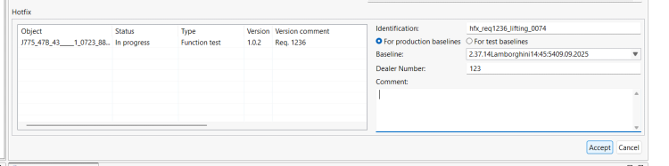

# **Step 6 – Attendere il popup di completamento**

Dopo **Accept**:

Attendere il popup che conferma:

**esecuzione completata con successo**

- tutorials Page 17

---

## ** Comportamento noto**

Se **dopo 20–30 secondi** il popup **non appare**:

fare **UN click sopra alla pagina**

- il popup viene mostrato

- ❗Senza popup → hotfix **non valido**.

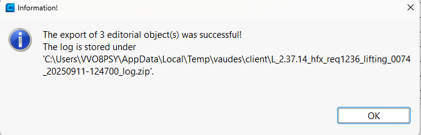

# **Step 7 – Recuperare il nome dell’hotfix**

Andare nella cartella condivisa (**sempre Deal Number 123**):

1.

\\vw.vwg\VWDFS\K-G\OM\8189-odis_oc_p\Basis_ODIS_S_P\Ausgangsdaten-OC

\Odishotf\BRAND-L\123

2. Individuare l’hotfix appena creato 3. **Copiare il nome esatto del pacchetto**

# **Step 8 – Comunicazione su Teams**

Aprire **Microsoft Teams**

1.

Andare nella chat / canale di riferimento

2.

Pubblicare l’avviso hotfix

3.

✅Contenuto minimo consigliato:

conferma hotfix pronto

- nome hotfix

- riferimento REQ (se presente)

- **Esempio:**

Hotfix pronto (release 09 – creato in 08):

hfx_req1236_fix_activation_issue

4. Pubblicare il messaggio

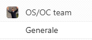

tutorials Page 18

---

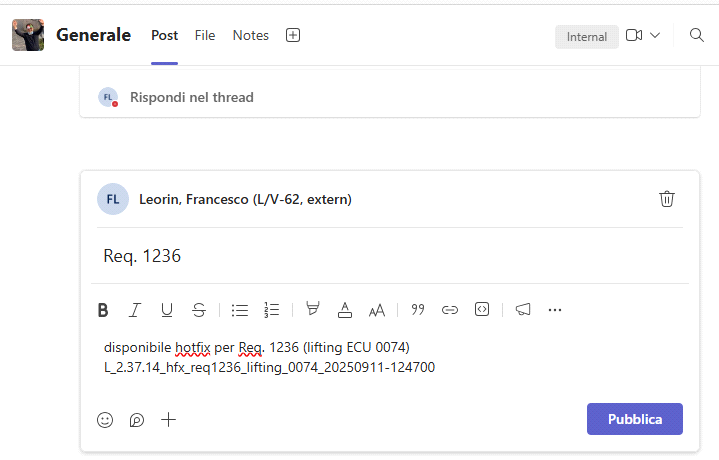

# **Risultato finale atteso**

✅Hotfix creato nel **periodo n-1 corretto**

- ✅Pacchetto presente in \\123

- ✅Nome comunicato al team

- ✅Tracciabilità garantita

- **Regole fisse (riassunto rapido)**

❗Hotfix **sempre nel periodo n-1**

- ❗hfx sempre nell’identification

- ❗Deal Number = 123

- ✅OK usare REQ

- ❗Senza popup → hotfix non valido

- ✅Se popup non appare → click sulla pagina

- tutorials Page 19

---

Perfetto, ti preparo un **tutorial tecnico, step-by-step** per **coding a restart / reset**, coerente con

**ASAM EKUCOM** e con **le schermate che hai fornito**, nello stesso stile operativo dei tutorial

precedenti.

# **TUTORIAL – Coding a Restart / Reset (ASAM **

# **EKUCOM)**

# **Scopo**

Questo tutorial descrive come **implementare un reset / restart** utilizzando un **ASAM EKUCOM**

nel tool di authoring diagnostico, selezionando correttamente:

la **variant del control module**

- il **progetto EV**

- il **diagnostic service di reset** (soft o hard)

- i **parametri corretti**

- **Prerequisiti**

Accesso all’ambiente di authoring

- Contesto EKUCOM disponibile

- Progetto EV presente e valido

- Conoscenza di quale reset sia richiesto (normal vs hard)

- **Step 1 – Identificare l’ASAM EKUCOM**

Nel diagramma / editor:

individuare il blocco **ASAM EKUCOM**

- 1.

Verificare che sia chiaramente etichettato come:

2.

ASAM EKUCOM

✅Questo tipo di oggetto è necessario per il restart/reset ECU.

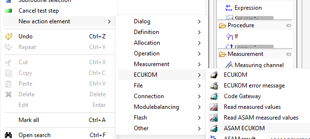

# 15.2 Code a Restart-Reset

martedì 21 aprile 2026

17:03

tutorials Page 20

---

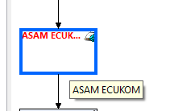

# **Step 2 – Double click sull’ASAM EKUCOM**

Fare **double click** sull’oggetto **ASAM EKUCOM**

1.

Si apre la finestra di configurazione con le sezioni:

Control module variant

- Diagnostic service

- Logical link

- Parameters

- 2.

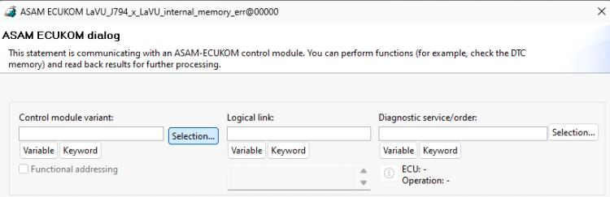

# **Step 3 – Control module variant**

Nel riquadro **Control module variant**:

Selezionare: Selection…

1.

Si apre la finestra di selezione editoriale

2.

## **Selezione corretta**

✅**Select project**

- ✅**EV**

- Non usare varianti sbagliate o legac  se non richiesto.

Confermare la selezione.

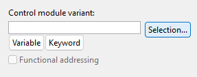

tutorials Page 21

---

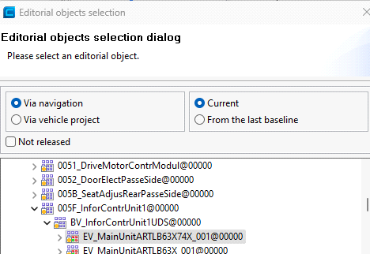

# **Step 4 – Selection from Diagnostic service / order**

Nella sezione **Selection from Diagnostic service/order**

1.

Cliccare su: Selection…

2.

Si apre la finestra **Operation/service selection dialog**.

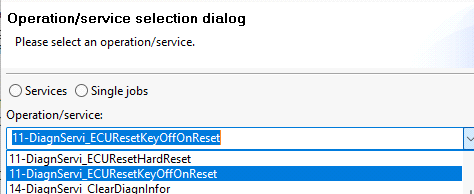

# **Step 5 – Selezionare il reset**

All’interno dell’elenco **Diagnostic services**:

Individuare il servizio di reset, tipicamente: ECUReset

1.

Selezionare:

**normal reset** per casi standard

- **hard reset** se richiesto esplicitamente

- 2.

sare ** ard reset solo se necessario**.

tutorials Page 22

---

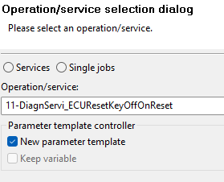

# **Step 6 – Parametri (popup)**

Quando appare il popup dei parametri:

Impostare i parametri **come mostrato**

1.

Tipicamente:

usare il **template di parametri**

- non forzare variabili non richieste

- 2.

Verificare:

nessun parametro mancante

- mapping corretto

- 3.

✅Lasciare i default se non diversamente specificato.

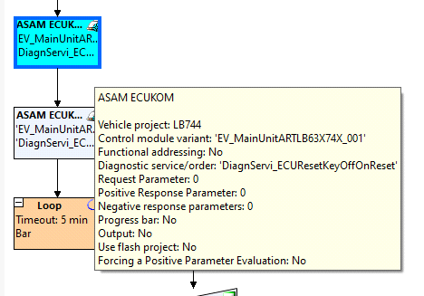

# **Step 7 – Confermare**

Cliccare su: OK

1.

Il servizio di reset viene applicato all’**ASAM EKUCOM**.

# **Verifica visiva finale**

Dopo la conferma:

l’ASAM EKUCOM mostra:

- tutorials Page 23

---

progetto EV selezionato

- servizio diagnostico di reset associato

- la configurazione è completa

- l’oggetto è pronto per:

validazione

- integrazione nel flusso

- successive fasi di complete / release

- **Note operative importanti**

✅Questo metodo è valido **solo per ASAM EKUCOM**

- ❗Verificare sempre la **variant corretta**

- ❗Selezionare **hard reset solo se richiesto**

- ✅I parametri errati portano a:

esecuzione fallita

- comportamento ECU non previsto

- **Risultato atteso**

Restart / reset correttamente codificato

- Diagnostica coerente con progetto EV

- Servizio pronto per uso in test plan o flash sequence

- tutorials Page 24

---

# **Tutorial – Impostazioni funzioni batteria**

*(Restart / Battery disconnect con funzione diagnostica attiva)*

# **Scopo**

Per diverse funzioni diagnostiche è necessario gestire **riavvii ECU o stacchi batteria**,

assicurandosi che **la funzione diagnostica continui a essere eseguita anche senza **

**alimentazione 12V**.

Questo tutorial descrive come **configurare correttamente la GFF** impostando **Without 12V **

**power supply** sull’oggetto diagnostico utilizzato.

# **Quando applicare questa impostazione**

sare questa configurazione quando:

è richiesto **restart ECU**

- è richiesto **battery disconnect**

- la funzione diagnostica **deve proseguire anche senza alimentazione**

- **Step 1 – Entrare nella Knowledge Base**

Aprire la **Knowledge Base**

1.

Navigare nella struttura funzionale

2.

Individuare l’**oggetto padre** che contiene l’oggetto diagnostico condiviso

3.

✅Punto chiave:

**si parte sempre dall’oggetto padre**, NON direttamente dalla singola GFF.

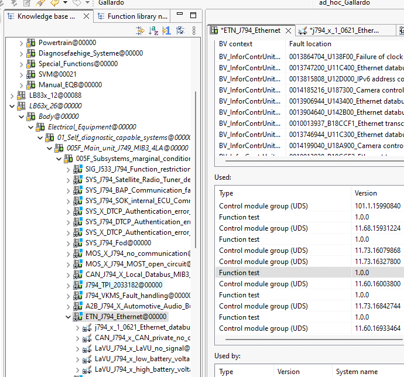

# 11.0 Battery related functions

martedì 21 aprile 2026

17:09

tutorials Page 25

---

# **Step 2 – Entrare nella lista delle funzioni che usano **

# **l’oggetto diagnostico**

Selezionare l’oggetto diagnostico

1.

Aprire la vista **Used by / Used in**

2.

Visualizzare l’elenco di **tutte le funzioni (GFF)** che utilizzano quell’oggetto

3.

Questo consente di capire **quali funzioni sono impattate** dalla modifica.

# **Step 3 – Andare alla GFF da modificare**

Nell’elenco delle funzioni:

individuare la **GFF target**

- 1.

Selezionare la GFF

2.

Restare nella vista tabellare delle funzioni

3.

# **Step 4 – Colonna “ 2V power supply”**

Individuare la colonna:

1.

12V power supply

2. Posizionarsi sulla **cella corrispondente alla GFF selezionata**

# **Step 5 – Edit usage**

tutorials Page 26

---

Click destro sulla cella

1.

Selezionare:

2.

Edit usage

Si apre la finestra **Function test usage editor**.

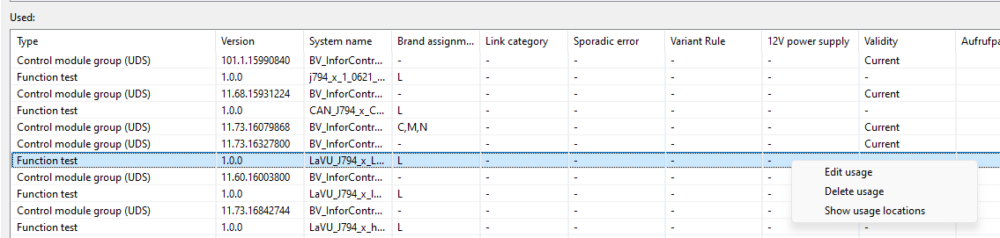

# **Step 6 – Confermare Without 12V power supply**

Nella finestra **Function test usage editor**:

Verificare la spunta su: Without 12V power supply

1.

Confermare l’impostazione

2.

Questa conferma è **obbligatoria**

Senza questa spunta, la funzione si interrompe allo stacco batteria.

# **Step 7 – Salvare**

Salvare la modifica

1.

Chiudere l’editor

2.

# **Risultato finale**

✅La funzione diagnostica:

**continua l’esecuzione**

- **anche in caso di riavvio ECU**

- **anche in caso di stacco batteria**

- ✅Il comportamento è coerente con:

funzioni di recovery

- procedure di reset

- sequenze con power cycling

- tutorials Page 27

---

# **Note operative importanti**

❗L’impostazione va fatta **sulla GFF**, non sull’oggetto diagnostico singolo

- ✅Partire sempre dall’oggetto padre per individuare tutte le funzioni coinvolte

- ❗Senza conferma “Without 12V power supply” la funzione **non è robusta**

- ✅Applicare solo alle funzioni che **necessitano realmente** di questo comportamento

- **Riassunto rapido**

Entrare da **oggetto padre**

- Vedere le funzioni che lo usano

- Selezionare la GFF corretta

- Colonna **12V power supply**

- **Edit usage**

- ✅Confermare **Without 12V power supply**

- Salvare

- tutorials Page 28

---

# **TUTORIAL – Copy, Cut, Paste e Reuse in ODIS **

# **Creator**

# **Scopo**

Questo tutorial spiega:

gli **usi principali** di *Copy, Cut, Paste e Reuse*

- le **differenze funzionali** tra le varie operazioni

- **quando usare cosa**

- **come usare correttamente la multiselezione**

- il concetto di **soft-copy (link/puntatore)** tramite *Reuse*

- **Concetti base (prima di iniziare)**

In ODIS Creator **non tutte le “copie” sono uguali**:

**Operazione**

**Tipo**

**Comportamento**

Copy + Paste Copia fisica

L’oggetto viene duplicato

Cut + Paste

Spostamento

L’oggetto viene rimosso dall’origine

Reuse

Soft-copy / link Puntatore all’oggetto originale

Capire questa differenza è fondamentale per **evitare duplicazioni inutili** o **perdere **

**allineamento funzionale**.

# **COPY**

## **Cos’è**

Crea una **copia fisica** dell’oggetto

- La copia è **indipendente dall’originale**

- **Come fare**

Selezionare l’oggetto

1.

Click destro → **Copy**

2.

# **CUT**

## **Cos’è**

**Rimuove** l’oggetto dalla posizione attuale

- Serve per **spostarlo** altrove

- **Come fare**

Selezionare l’oggetto

1.

Click destro → **Cut**

2.

Attenzione: se sbagli nodo di destinazione, hai **rotto la struttura**, non copiato.

# **PASTE**

## **Cos’è**

Incolla ciò che è stato copiato o tagliato

- 5.1 Copy Cut Paste Reuse

giovedì 23 aprile 2026

15:02

tutorials Page 29

---

Il comportamento dipende **da cosa incolli e come**

- **Tipi di Paste (importante)**

**Paste** → copia/spostamento normale

- **Paste → Reuse as subnode** → crea una soft-copy

- **REUSE (concetto chiave)**

## **Cos’è davvero il Reuse**

**NON è una copia**

- È un **link / puntatore / soft-copy**

- Stai riutilizzando **lo stesso oggetto**

- **Effetto pratico**

Tutte le modifiche fatte all’oggetto originale

✅vengono riflesse automaticamente su tutte le reuse

# **Reuse vs Paste (differenza pratica)**

## **Scenario tipico**

*Tutte le GFF di Revuelto sono buone per Temerario*

In questo caso **NON si copiano le GFF**

Si fa **Reuse**

## **Perché usare Reuse**

na sola fonte di verità

- Nessuna duplicazione

- Fix e miglioramenti propagati automaticamente

- **Riassunto**

**Paste normale** → nuova copia, scollegata

- **Reuse** → stesso oggetto, stesso comportamento

- **Come fare Reuse as subnode (passaggi corretti)**

In **Temerario**, creare o selezionare la sezione target

1.

Click destro sulla sezione

2.

Selezionare:

3.

Reuse as subnode

4. Selezionare l’oggetto (o gli oggetti) sorgente 5. Confermare

✅Il nodo creato è una **soft-copy**

# **MULTISELEZIONE (QUI SERVE CALMA)**

## **È possibile copiare più oggetti?**

✅**Sì**

Ma va fatto nel modo corretto

>> vedi tutorial multiselezione

## **Dopo la multiselezione**

Click destro → **Copy**

- Oppure → **Paste → Reuse as subnode**

- ✅Funziona anche con gruppi di GFF

tutorials Page 30

---

# **Paste come Reuse as subnode**

Quando incolli:

Posizionarti nel nodo di destinazione

1.

Click destro

2.

Selezionare:

3.

Paste → As subnode → Reuse

✅Stai creando **link**, non copie

# **Cosa IGNORARE**

**Le XY**

❌non sono rilevanti per:

Copy

- Paste

- Reuse

**Da ignorare completamente**

- **Errori comuni da evitare**

❌Copiare GFF uguali per progetti diversi

❌Duplicare funzioni quando serve solo reuse

❌Multiselezionare troppo velocemente

❌Usare Copy quando serve Reuse

# **Regole d’oro (takeaway)**

✅Se vuoi **allineamento automatico** → **Reuse**

- ✅Se vuoi **variante indipendente** → **Copy**

- ✅Se devi solo spostare → **Cut**

- ✅Multiselezione = **CTRL + calma**

- ❌Duplicare GFF senza motivo = debito tecnico

- tutorials Page 31

---

Perfetto

allora facciamo **un tutorial dedicato SOLO alla multiselezione in ODIS Creator**, integrando

tutto quello che hai detto **in modo strutturato**, chiaro e “da manuale interno”, **senza mischiarlo**

con Copy / Reuse ecc.

# **TUTORIAL – Multiselezione in ODIS Creator**

*(CTRL, SHIFT, ramificazione e limiti di sicurezza)*

# **Scopo**

Questo tutorial spiega **come funziona correttamente la multiselezione in ODIS Creator**,

perché è **più restrittiva rispetto alla selezione singola** e quali sono i **comportamenti diversi** in

base a:

uso di **CTRL**

- uso di **SHIFT**

- stato della **ramificazione aperta o chiusa**

- limiti di sicurezza del tool

- **Concetto chiave (prima di iniziare)**

**La multiselezione in ODIS Creator NON è equivalente alla selezione singola moltiplicata **

**per N.**

Per **motivi di sicurezza e integrità dei dati**, quando selezioni più oggetti:

alcune azioni sono **limitate**

- alcune operazioni sono **più lente**

- il tool è **più sensibile al modo in cui clicchi**

- Serve metodo. E calma.

# **Procedura corretta base (CTRL)**

## **Metodo standard (oggetti non adiacenti)**

✅Usare questo metodo quando gli oggetti **non sono consecutivi** nell’albero.

## **Passaggi**

**Tenere premuto CTRL**

**1.**

**Selezionare UN oggetto alla volta**

**2.**

**Piccola pausa tra un click e l’altro**

**3.**

Continuare finché **tutti gli oggetti sono selezionati**

4.

Nota importantissima

ODIS Creator **non ama i click rapidi a mitraglia**

→ **CALMAAAAAAAAAAA**

Se clicchi troppo velocemente:

selezioni solo l’ultimo elemento

- o perdi parte della selezione

- o il tool “si confonde” (comportamento noto)

- **Multiselezione con SHIFT (oggetti adiacenti)**

✅Metodo alternativo **solo per oggetti consecutivi**.

## **Quando usarlo**

# 5.2 Multiselection

giovedì 23 aprile 2026

15:15

tutorials Page 32

---

gli oggetti sono **uno sotto l’altro**

- si trovano **allo stesso livello**

- **Passaggi**

Selezionare il **primo oggetto**

1.

Tenere premuto **SHIFT**

2.

Selezionare l’**ultimo oggetto della sequenza**

3.

✅ODIS Creator seleziona **tutti gli elementi intermedi**

Limitazione:

funziona **solo su sequenze continue**

- non funziona su oggetti “sparsi” nell’albero

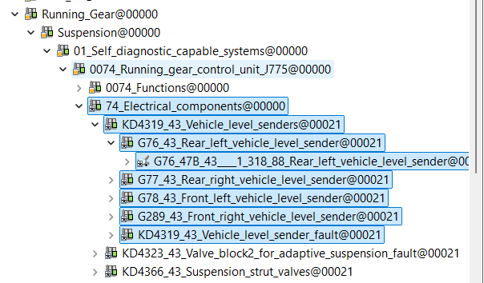

- **Effetto della ramificazione (CHIAVE)**

Il comportamento della multiselezione **dipende dallo stato dell’albero**.

## **Caso 1 – Ramificazione CHIUSA**

Se **NON è aperta tutta la ramificazione**:

selezioni solo gli oggetti **visibili a quel livello**

- **gli oggetti figli NON sono esplicitamente selezionati**

- ma possono essere **implicitamente coinvolti** in alcune operazioni

- Tipico scenario:

stai selezionando **oggetti padre**

- l’azione può coinvolgere **tutti i figli contenuti**

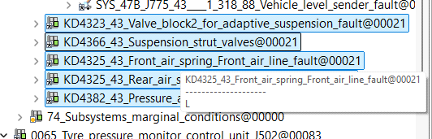

- **Caso 2 – Ramificazione APERTA**

Se **TUTTA la ramificazione è aperta**:

vengono **selezionati esplicitamente **

- tutorials Page 33

---

oggetti padre

- oggetti figli

- sotto-nodi

- ogni elemento è **individualmente incluso nella selezione**

- ✅Vantaggio:

controllo totale

- è possibile **deselezionare singoli elementi dopo**

- Svantaggio:

selezione più pesante

- maggiore carico sul tool

- più rischio di operazioni non volute

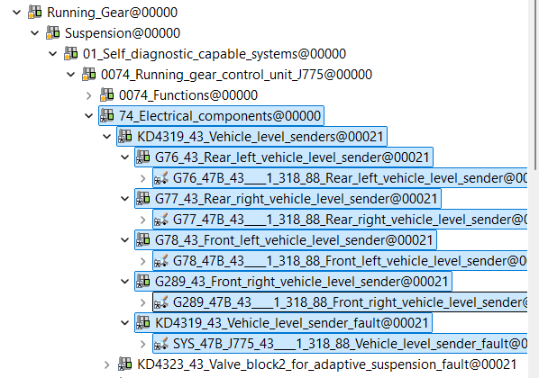

- **Deselezione parziale (best practice)**

Quando la ramificazione è tutta aperta:

Effettuare la multiselezione

1.

Tenere **CTRL**

2.

Cliccare sugli elementi da **escludere**

3.

✅Ottimo metodo per:

rifinire la selezione

- evitare lavorazioni su oggetti non desiderati

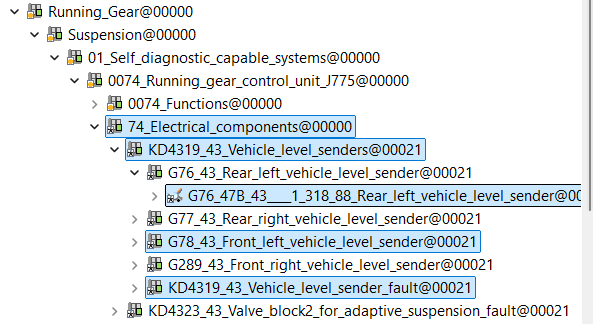

- tutorials Page 34

---

# **Limiti e sicurezza della multiselezione**

**O IS Creator limita volutamente cosa puoi fare con pi  oggetti selezionati**, ad esempio:

alcune operazioni di editing avanzato

- modifiche potenzialmente distruttive

- azioni che su singolo oggetto sono consentite

- Questo è **voluto**, per evitare:

modifiche massive involontarie

- corruzione della struttura

- incoerenze editoriali

- Regola pratica:

**Se un’azione critica non è disponibile in multiselezione, è una protezione, non un **

**bug.**

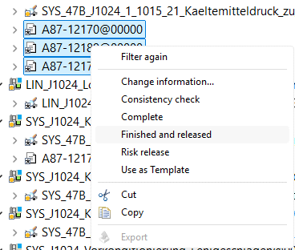

# **Errori comuni da evitare**

❌Click troppo rapidi

❌Multiselezione “a caso” senza guardare la ramificazione

❌Usare SHIFT su oggetti non consecutivi

❌Credere che multiselezione = poteri infiniti

❌Non controllare cosa è realmente selezionato

# **Riassunto operativo**

✅CTRL → oggetti separati

- ✅SHIFT → oggetti adiacenti

- ✅Ramificazione chiusa → selezione per livelli

- ✅Ramificazione aperta → selezione esplicita di tutto

- ✅Possibile **deselezione fine** con CTRL

- ❗Multiselezione = **più limiti, più attenzione**

- Sempre: **C L            **

- tutorials Page 35

---

# **ODIS Creator – Simboli e icone per elementi e **

# **stati**

# **Scopo**

Questo tutorial descrive il **significato delle icone utilizzate in ODIS Creator** per rappresentare:

**stato degli oggetti** (In progress, Completed, Released, Referenced)

- **tipologia di elementi** (funzioni, oggetti diagnostici, BV, EV, cartelle)

- **simboli di errore o anomalia** (es. X rossa)

- Capire correttamente queste icone permette di:

interpretare immediatamente la **struttura diagnostica**

- riconoscere lo **stato di avanzamento** degli oggetti

- evitare **azioni non consentite** o **usage errati**

- individuare **problemi strutturali** prima di:

Complete

- Risk Release

- Usage Calculation

- lavorare in modo **più rapido, sicuro e coerente** su strutture complesse

- Questo documento raccoglie **in un unico riferimento** tutte le icone rilevanti utilizzate in

ODIS Creator, incluse quelle **strutturali e di validità**, spesso causa di errori se mal interpretate.

# **STATI degli oggetti**

Le icone di stato compaiono come **piccoli simboli sovrapposti** al nodo, tipicamente **in basso a **

**sinistra** o **in alto a destra**.

# ***  In progress**

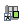

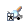

**Icona**: asterisco *

- **Posizione**: in basso a sinistra su **quadretto bianco**

- **Significato**:

oggetto in lavorazione

- modificabile

- non completato

- Stato tipico subito dopo creazione o modifica.

# 0.0 Simboli e Icone

tutorials Page 36

---

## ✅**Completed**

**Icona**: spunta ✔

- **Posizione**: in basso a sinistra su **quadretto bianco**

- **Significato**:

lavorazione completata

- pronto per release

- non più in editing attivo

- **Released**

**Icona**: quadretto giallo

- **Posizione**: in basso a sinistra

- **Significato**:

oggetto rilasciato

- stato stabile

- utilizzabile a valle (es. in test / deployment)

- **Referenced**

**Icona**: quadrettino azzurro

- **Posizione**: in alto a destra

- **Significato**:

l’oggetto è **referenziato / riusato**

- tipicamente risultato di **Reuse**

- soft-cop  / link all’originale

- Importante:

Le modifiche sull’originale si riflettono su tutti gli oggetti **referenced**.

# **ELEMENTI (tipologia di oggetto)**

Queste icone identificano **che tipo di elemento** stai guardando, indipendentemente dallo stato.

## **Oggetti diagnostici**

**Icona**: quadretto grigio **quadrettato**

- **Significato**:

diagnostic object

- tutorials Page 37

---

contenitore logico di logica diagnostica

- spesso riutilizzato tra più funzioniù

- **Funzioni (GFF / Function test)**

**Icona**: **piccola lente** sopra un’automobile

- **Significato**:

funzione diagnostica

- test guidato

- workflow eseguibile

- È l’elemento più usato a livello operatore.

## **Info / Testo**

**Icona**: **piccolo foglio**

- **Significato**:

elementi informativi

- testo descrittivo

- istruzioni o spiegazioni

- nessuna logica attiva

- **BV – Basic Variant**

**Icona**: griglia di piccoli quadretti viola

(spesso con sovrapposizione di stato: spunta, asterisco, ecc.)

- **Significato**:

**Basic Variant**

- rappresenta una **variante base di configurazione diagnostica**

- punto di aggregazione per:

EV

▪

GFF

▪

Control module group

▪

- **Utilizzo tipico**:

collegamento tra progetto / piattaforma e contenuti diagnostici

- base per coverage e usage calculation

- Nota: Il BV **non è una funzione** e **non è un EV**, ma un **elemento strutturale**.

tutorials Page 38

---

## **EV – Electronic Variant**

**Icona**: griglia viola con:

**cartella gialla**

- **indicatori colorati** (verde / rosso)

- **Significato**:

**Electronic Variant**

- definisce il contenuto diagnostico specifico della **centralina**

- contiene:

DTC

▪

dati diagnostici

▪

associazioni a GFF

▪

- **Utilizzo tipico**:

import / gestione DTC

- allineamento con ODX / PDX

- riferimento per copertura e release

- Nota: Ogni centralina **deve** avere un EV coerente per:

copertura

- usage calculation

- validazione diagnostica

- **Cartelle (folder di struttura)**

**Icona**: cartella gialla / cartella tecnica (talvolta con overlay)

- **Significato**:

elemento **puramente organizzativo**

- used to:

raggruppare oggetti

▪

ordinare logica e struttura

▪

- **Esempi di contenuto**:

gruppi progetto (LB63x)

- Control module group

- contenitori temporanei

- Importante:

le cartelle **NON hanno logica diagnostica**

- **NON vanno rilasciate**

- servono solo per struttura e navigazione

- **SIMBOLI DI ERRORE / ANOMALIA**

tutorials Page 39

---

## ❌**X rosso – Oggetto non valido / non utilizzabile**

**Icona**: grande **X rossa** sovrapposta alla cartella o all’oggetto

- **Significato**:

oggetto **non valido nello stato corrente**

- oppure con **problemi strutturali**

- **Cause tipiche**:

riferimento rotto (reuse errato)

- EV / GFF non compatibile con il contesto

- errori di migrazione

- stato non coerente (es. usage su oggetto non rilasciato)

- Comportamento:

l’oggetto **non viene considerato **

nel coverage

- nella usage calculation

- deve essere **analizzato prima di procedere**

- ❗NON ignorare mai una X rossa:

è un **errore strutturale**, non un warning.

# **RELAZIONE CON GLI STATI**

Le icone BV, EV, Cartella e X rossa:

**possono coesistere** con gli stati:

In progress

- Completed

- Released

- Referenced

- lo **stato** indica il lifecycle

- l’**icona principale** indica la **natura dell’oggetto**

- **Riepilogo rapido (takeaway)**

## **Stati**

* su quadretto bianco → **In progress**

- ✔su quadretto bianco → **Completed**

- quadretto giallo → **Released**

- quadrettino azzurro (alto dx) → **Referenced**

- **Elementi**

Quadretto grigio → **Oggetto diagnostico**

- Lente + auto → **Funzione (GFF)**

- Foglio → **Info / Testo**

- Griglia viola → **BV (Basic Variant)**

- Griglia + cartella → **EV (Electronic Variant)**

- Cartella → **contenitore strutturale**

- ❌X rossa → **oggetto non valido / errore strutturale**

- **Nota finale (best practice)**

tutorials Page 40

---

Se vedi un’icona che **non ti aspetti**,

fermati prima di:

fare Finished

- fare Risk Release

- fare Usage Calculation

- Un’icona sbagliata **oggi** diventa un problema di coverage **domani**.

tutorials Page 41

---

# **Cambi di stato degli oggetti**

In ODIS Creator il passaggio di stato degli oggetti avviene **esclusivamente tramite menu **

**contestuale (click destro)** e segue regole precise.

**In progress → Completed**

Quando un oggetto ha terminato la fase di editing:

Click destro sull’oggetto

1.

Selezionare **Complete**

Lo stato dell’oggetto passa a **Completed**.

2.

- **Completed → Released**

Per rendere l’oggetto disponibile e rilasciato:

Click destro sull’oggetto

1.

Selezionare **Risk release**

Lo stato passa a **Released**.

2.

- **In progress → Released (diretto)**

È possibile saltare lo stato intermedio:

Click destro sull’oggetto ancora **In progress**

1.

Selezionare **Finished and released**

In questo modo l’oggetto viene **completato e rilasciato in un’unica operazione**.

2.

- 0.1 Cambi di stato degli oggetti

giovedì 23 aprile 2026

16:14

tutorials Page 42

---

Nota operativa:

Le azioni disponibili dipendono **dallo stato corrente dell’oggetto**; se una voce non è

selezionabile, è una protezione prevista dal tool.

Se ci mette troppo a caricare il nuovo stato, aggiornare la visualizzazione con Refresh all displays.

tutorials Page 43

---

# **TUTORIAL – Estrazione DTC da EVFile (.odx)**

## **Scopo**

Gli **EVFile (.odx)** sono file di **diagnostica** che contengono, tra le altre informazioni, anche i **DTC (Diagnostic **

**Trouble Codes)**.

Questo tutorial descrive **come estrarre correttamente i DTC dagli EV**, usando una **macro Excel**, e come

**selezionare il file ODX corretto** a partire dal sistema di versioning ufficiale.

✅Procedura utilizzata **in sviluppo (DEV)**

✅Output tipicamente usato per **import DTC su EV nelle pagine delle relative centraline**

## **Prerequisiti**

Accesso a **Microsoft Teams**

- Accesso a **System42**

- Accesso ai **PDX rilasciati**

- Excel con macro abilitate

- Permessi DEV

- **Parte 1 – Download e preparazione della macro**

## **Step 1 – Scaricare la macro da Teams**

Aprire **Microsoft Teams**

1.

Andare nel canale: Generale → Sviluppo GFF

2.

Scaricare la macro (file Excel), ad esempio: GFF_development_v2.xlsx

3.

Nota:

Questa macro è **da usare esclusivamente per DEV**

(viene usata per l’import dei DTC negli EV sulle pagine delle centraline).

## **Step 2 – Aprire il file Excel e abilitare le macro**

Aprire il file Excel

1.

Abilitare le **macro**, se richiesto

2.

## **Step 3 – Modificare il path del file di riferimento**

In Excel, andare su: View → Macros → View Macros

1.

Selezionare la macro principale

2.

Cliccare su: Edit

3.

Individuare la riga con l’apertura del file

4.

Modificare:

**percorso**

- **nome completo del file** in base alla tua postazione locale

- 5.

Salvare la macro

6.

# Estrazione DTC da EVFile (.odx)

lunedì 4 maggio 2026

09:22

tutorials Page 44

---

## **Parte 2 – Esecuzione della macro (estrazione DTC)**

## **Step 4 – Avviare la macro**

Tornare in: View → Macros

1.

Selezionare la macro

2.

Cliccare: Run

3.

## **Step 5 – Selezione EV (.odx)**

Durante l’esecuzione:

la macro chiede di selezionare il file **ODX** interessato

- questo file corrisponde all’**EV della centralina**

- NON scegliere un file a caso:

il prossimo step serve proprio a individuare **l’O X corretto**.

tutorials Page 45

---

## **Parte 3 – Individuazione dell’ODX corretto (System42)**

## **Step 6 – Accedere a System42**

Aprire **System42**

1.

Entrare in: Version42 → Version Management

2.

## **Step 7 – Selezione Diagnostic Data**

Selezionare: Diagnostic data

1.

Inserire il **Project Number**, ad esempio: 634

2.

## **Step 8 – Selezione PDX rilasciato**

Nella parte destra, sezione **PDX files**

1.

Selezionare:

**l’ULTI O P X rilasciato**

- 2.

✅ sare sempre l’ultimo ufficiale rilasciato

tutorials Page 46

---

## **Step 9 – Baseline Vehicle Platform**

Selezionare la **baseline vehicle platform** corrispondente

1.

Scaricare il PDX associato

2.

## **Parte 4 – Selezione dell’oggetto diagnostico corretto**

## **Step 10 – Aprire il PDX**

Aprire il file PDX scaricato

1.

Scorrere **molto in basso** fino alla sezione:

**Diagnostic objects**

- 2.

Espandere la struttura (albero)

3.

tutorials Page 47

---

## **Step 11 – Verifica stato oggetti**

Gli oggetti diagnostici hanno uno **stato visivo**:

**Giallo**

→ non approvato in modo definitivo

- **Verde**

→ rilasciato ufficialmente

- ✅**Usare SOLO oggetti VERDI**

## **Step 12 – Oggetti con stesso nome**

Se esistono **più oggetti con lo stesso nome**:

Considerare **SOLO quelli VERDI**

1.

Scegliere:

**major version più alta**

- a parità di major → **minor più recente**

- 2.

Regola:

**Major first, then most recent minor — solo tra i rilasciati ufficialmente**

## **Step 13 – Seconda conferma (best practice)**

Come ulteriore controllo:

verificare il **file più recente**

- a parità di versione, scegliere quello con:

**dimensione maggiore**

- È spesso indice di contenuto più completo.

## **Parte 5 – Estrazione DTC**

## **Step 14 – Usare l’ODX selezionato nella macro**

Tornare alla macro Excel

1.

Quando richiesto:

selezionare l’**ODX corretto**

- 2.

Confermare

3.

✅La macro estrae i ** TC dall’EV**.

## **Risultato finale**

✅DTC estratti dall’EVFile (.odx)

- ✅Dati pronti per:

import DEV

- aggiornamento EV sulle pagine centralina

- tutorials Page 48

---

✅Allineamento con **PDX ufficialmente rilasciati**

- **Note operative importanti**

❗La macro è **solo per DEV**

- ❗Usare **solo oggetti diagnostici VERDI**

- ✅In caso di dubbio, verificare:

versione

- dimensione file

- ❌NON usare EV / ODX non rilasciati ufficialmente

- tutorials Page 49

---

# **Tutorial – Battery related functions**

*(Restart ECU / stacco batteria con funzione diagnostica attiva)*

# **Scopo**

Per diverse funzioni diagnostiche è necessario effettuare un **riavvio ECU** o uno **stacco batteria**,

**mantenendo attiva la funzione diagnostica**.

Per ottenere questo comportamento è obbligatorio configurare correttamente l’uso dell’oggetto

diagnostico, **confermando l’opzione *****Without 12V power supply***.

✅Questa configurazione consente alla funzione di **proseguire anche in assenza di **

**alimentazione batteria**.

# **Quando applicare questa impostazione**

Usare questa procedura quando una funzione diagnostica:

richiede **power cycle**

- prevede **battery disconnect**

- deve **continuare l’esecuzione** durante o dopo lo stacco batteria

- **Impostazione chiave**

**Without 12V power supply**

Questa opzione va confermata nel **Function test usage editor** per permettere l’esecuzione della

funzione senza alimentazione 12V.

6+*

# **Sequenza operativa**

## **Step 1 –  artire dall’oggetto diagnostico padre**

Entrare nella **Knowledge Base**

1.

Navigare fino all’**oggetto diagnostico padre**

2.

Aprire la lista delle **funzioni che utilizzano tale oggetto diagnostico**

3.

Questo passaggio è fondamentale per individuare **tutte le GFF impattate**.

# 11 Battery related functions

lunedì 4 maggio 2026

10:48

tutorials Page 50

---

## **Step 2 – Visualizzare la lista “Used by”**

Nella vista *Used by* sono elencate:

funzioni (Function test)

- gruppi di controllo (Control module group – UDS)

- relative versioni

- Da qui selezionare **la GFF che si vuole modificare**.

## **Step 3 – Selezionare la GFF target**

Individuare la **GFF corretta**

1.

Selezionarla

2.

Posizionarsi sulla **cella corrispondente alla colonna**:

3.

12V power supply

tutorials Page 51

---

## **Step 4 – Edit usage**

Click destro sulla cella della GFF

1.

Selezionare:

2.

Edit usage

Si apre il **Function test usage editor**.

## **Step 5 – Confermare Without 12V power supply**

Nel **Function test usage editor**:

verificare che sia selezionato: Without 12V power supply

- confermare l’impostazione

- Dalle schermate fornite è visibile il passaggio:

da **non selezionato**

- a **selezionato**

- Questo step è **obbligatorio**.

## **Step 6 – Salvare**

Confermare

1.

Salvare la modifica

2.

# **Risultato finale**

✅La funzione diagnostica:

**rimane attiva**

- **non si interrompe**

- **continua anche se la batteria viene staccata**

- Questo comportamento è necessario per:

procedure di reset

- test post power-cycle

- recovery ECU

- funzioni battery-related avanzate

- tutorials Page 52

---

# **Note operative importanti**

❗L’impostazione va fatta **a livello di GFF usage**, non sull’oggetto diagnostico singolo

- ✅Sempre partire dall’**oggetto padre**

- ✅Applicare solo alle funzioni che **lo richiedono realmente**

- ❌Non impostare Without 12V power supply “a tappeto” senza motivo

- **Riassunto rapido**

Oggetto diagnostico → lista funzioni

- Selezionare la GFF

- Colonna **12V power supply**

- **Edit usage**

- ✅Confermare **Without 12V power supply**

- Salvare

- tutorials Page 53

---

# **Tutorial – Estrazione DTC già coperti per **

# **ogni centralina**

# **Scopo**

Questa procedura permette di:

identificare **quali DTC sono già coperti** per ciascuna centralina

- partendo da **ODIS Creator**

- passando da **Usage Calculation**

- con **export da Order Management**

- e analisi finale in **Excel**

- Il risultato finale è una **percentuale di copertura DTC** riportabile in dashboard.

# **Prerequisiti**

Accesso a **ODIS Creator**

- Accesso a **Order Management**

- Excel

- File di riferimento **GFF_development**

- Conoscenza del **modello / progetto** (es. 636)

- **Parte 1 – ODIS Creator: Usage Calculation**

## **Step 1 – Aprire il Control Module Tree**

In **ODIS Creator**, entrare in: Control Module Tree

1.

Selezionare: Base Control Modules

2.

## **Step 2 – Selezionare il modello**

Navigare fino al **modello di interesse **

esempio: 636

- 1.

Espandere il nodo

2.

✅Vengono mostrate **tutte le centraline (ECU)** del modello.

# 7.3 Estrazione DTC già coperti per ogni centralina

lunedì 4 maggio 2026

11:05

tutorials Page 54

---

## **Step 3 – Identificare le ECU interessate**

Per capire **quali ECU sono rilevanti**:

usare come riferimento il file: GFF_development

- individuare le centraline coinvolte dalle funzioni GFF

- **Step 4 – Eseguire Usage Calculation**

Avviare la **Usage Calculation**

1.

Attendere il completamento

2.

tutorials Page 55

---

## **Step 5 – Compilare la finestra di Usage Calculation**

Quando si apre la finestra:

Compilare i campi:

**Project**

- **Centralina (ECU)**

- **Status**

- **Step 6 – Export Usage Calculation**

Cliccare: Export

1.

L’operazione deve restituire una **risposta positiva**

2.

tutorials Page 56

---

✅L’export viene salvato ed è utilizzabile in Order Management.

# **Parte 2 – Order Management: recupero **

# **export**

## **Step 7 – Accedere a Order Management**

Aprire **Order Management**

1.

Entrare in: Tasks

2.

## **Step 8 – Impostare i filtri**

Aprire il **filtro**

1.

Impostare l’intervallo **Date**

2.

Cliccare su: + per aggiungere un filtro

3.

**Esempio filtro**:

tipo export

- data corrente

- progetto

- **MEMO IMPORTANTE**

Il filtro va scritto **una sola volta**.

Negli accessi successivi (stessa giornata) è sufficiente fare **Refresh** per farlo

riapparire.

tutorials Page 57

---

## **Step 9 – Salvare il risultato export**

Selezionare l’export appena creato

1.

Cliccare: Save result

2.

Salvare con **nome significativo**, ad esempio: <codice_centralina>_export

3.

# **Parte 3 – Analisi del file Excel**

## **Step 10 – Aprire il file ottenuto**

Aprire il file Excel esportato da Order Management.

tutorials Page 58

---

## **Step 11 – Estrazione codice DTC**

Cercare i DTC nella **colonna J**

1.

I DTC hanno formato: DAXXXX_YYYY

2.

## **Step 12 – Inserire colonne di appoggio**

Inserire **due colonne vuote J e K**

1.

Nella nuova colonna inserire la formula:

2.

=MID(cella_DTC;12;7)

Serve a estrarre il **codice DTC puro**

## **Step 13 – Estendere la formula**

Fare **doppio click** sull’angolo della cella (come in screenshot)

- La formula viene estesa a tutte le righe utili

- **Step 14 – Pagina di appoggio**

tutorials Page 59

---

Creare una **pagina di appoggio**

1.

Inserire:

elenco DTC estratti

- 2.

Aggiungere una **colonna “x”** accanto

3.

## **Step 15 – Verifica DTC presenti nella centralina**

Usare **VLOOKUP** per verificare la presenza dei DTC nella pagina EV della centralina

(es. DAxxxx_LByyy).

Esempi formule:

=VLOOKUP(B5;Sheet2!$A$1:$B$lastcell;2;FALSE)

oppure

=VLOOKUP(B5;$K$1:$L$lastcell;2;FALSE)

Se trovato → restituisce valore

- Se non trovato → #N/A

- tutorials Page 60

---

## **Step 16 – Pulizia risultati**

✅Eliminare / ignorare:

tutti i #N/A

- **Step 17 – Contare solo i DTC coperti**

Calcolare la percentuale di copertura:

=COUNTA(I5:I2040)/COUNTA(B5:B2040)

Numeratore → DTC coperti (x)

- Denominatore → DTC totali

- **Parte 4 – Dashboard**

## **Step 18 – Riportare il risultato %**

Nella dashboard principale:

='DA0009'!I2

✅In questo modo la dashboard mostra:

la **percentuale reale di copertura DTC**

- per ciascuna centralina

- tutorials Page 61

---

# **Risultato finale**

✅Elenco DTC coperti

- ✅Verifica rispetto alle EV delle centraline

- ✅Percentuale di copertura calcolata

- ✅Dato pronto per **dashboard o reporting**

- **Note operative importanti**

❗Riferirsi sempre a **Export usage calculation ufficiali**

- ✅Usare nomi file chiari (ECU_export)

- ✅Il filtro in Order Management va creato **una sola volta**

- ❌Non mescolare progetti o modelli diversi

- **Riassunto rapido del flusso**

Control Module Tree

1.

Usage Calculation

2.

Export

3.

Order Management → Tasks

4.

Save result

5.

Analisi Excel

6.

VLOOKUP

7.

Percentuale

8.

Dashboard

9.

tutorials Page 62

---

# **Tutorial – Copertura GFF**

# **Scopo**

Questa procedura descrive come:

costruire correttamente un **gruppo di copertura GFF**

- collegare **KBN, GFF ed EV** al **Control Module Tree**

- completare e rilasciare il gruppo

- eseguire la **Usage Calculation** finale

- Il risultato è una **copertura GFF coerente e calcolabile** per il progetto.

# **Prerequisiti**

Accesso a **ODIS Creator**

- Progetto disponibile (es. **LB63x**)

- Knowledge Base (KBN) esistente

- EV già presenti per la centralina

- **Step 1 – Control Module Tree**

Aprire **Control Module Tree**

1.

Navigare in: Base Control Modules

2.

Selezionare la **cartella progetto **

esempio: LB63x

- 3.

Questa è la base su cui verrà costruita la copertura.

# 7.2 Copertura GFF

lunedì 4 maggio 2026

11:38

tutorials Page 63

---

# **Step 2 – Aprire la Knowledge Base (KB)**

Aprire **Knowledge Base Navigator**

1.

Individuare la **KB**

2.

**Double click** sulla KB

La Knowledge Base si apre **separatamente** dal Control Module Tree

**3.**

# **Step 3 – Copiare la KB**

Selezionare la **cartella KB**

1.

Click destro → **Copy**

2.

Non modificare ancora nulla.

# **Step 4 – Creare il gruppo nel Control Module Tree**

Tornare al **Control Module Tree**

1.

Creare un **nuovo gruppo** sotto la cartella progetto (LB63x)

2.

tutorials Page 64

---

# **Step 5 – Reuse della KB come subnode**

Click destro sul **nuovo gruppo**

1.

Selezionare: Reuse → As subnode

2.

Selezionare la **KB copiata**

3.

✅La Knowledge Base è ora **referenziata (soft-copy)** dentro il gruppo.

# **Step 6 – Copy / Reuse anche dell’EV**

Individuare l’**EV già presente** (relativo alla centralina)

1.

Eseguire **Copy** oppure **Reuse**

2.

Inserirlo **come subnode nello stesso gruppo**

3.

Importante:

KBN e EV devono convivere **nello stesso gruppo**

- Questo è necessario per la copertura GFF.

- **Step 7 – Finished sull’oggetto gruppo**

Selezionare l’**oggetto gruppo**

1.

Click destro → **Finished**

2.

Nota operativa:

Se passa del tempo e **non sembra terminato**:

dare **un colpetto di aggiornamento** (refresh)

- tutorials Page 65

---

# **Step 8 – Verifica completamento Finished**

Quando:

compare la **spunta** sull’oggetto gruppo

- ✅significa che il **Finished è completato correttamente**.

Solo a questo punto si può procedere oltre.

# **Step 9 – Risk Release del gruppo**

Click destro sull’oggetto gruppo

1.

Selezionare: Risk release

2.

Dopo il completamento:

l’oggetto mostra il **quadretto giallo**

- ✅Stato: **Released**

# **Step 10 – Usage Calculation**

Click destro sul gruppo rilasciato

1.

Selezionare: Usage calculation

2.

✅Ora la copertura GFF può essere:

calcolata

- esportata

- usata per analisi di copertura

- **Risultato finale**

✅Gruppo GFF correttamente costruito

- ✅KB ed EV collegati

- ✅Oggetto **Finished**

- ✅Oggetto **Risk released**

- ✅Usage Calculation disponibile

- **Errori comuni da evitare**

❌Usare Copy invece di Reuse per la KBN senza motivo

❌Dimenticare di includere l’EV nel gruppo

❌Fare Usage Calculation **prima** del Risk Release

❌Non controllare la spunta dopo Finished

# **Riassunto rapido del flusso**

Control Module Tree → progetto (LB63x)

1.

Aprire KB separatamente

2.

Copy KB

3.

tutorials Page 66

---

Creare gruppo

4.

Reuse KB come subnode

5.

Copy/Reuse EV

6.

Finished gruppo

7.

Spunta = ok

8.

Risk release (quadretto giallo)

9.

Usage Calculation

10.

tutorials Page 67

---

# **Tutorial – Verificare se uno ZDC è presente**

# **Scopo**

Questo tutorial descrive come **verificare la presenza di uno ZDC (Zonal Data Container)** per

una determinata **ECU**, utilizzando **System42**.

La verifica dello ZDC è necessaria per:

confermare la disponibilità dei dati target

- validare configurazioni diagnostiche

- evitare incoerenze tra EV / ODX / dati di piattaforma

- **Prerequisiti**

Accesso a **System42**

- Visibilità sull’ambiente **version42**

- Conoscenza della **ECU da verificare**

- Conoscenza del **modello / progetto Lamborghini**

- **Step 1 – Aprire System42**

Avviare **System42**

1.

Dal menu laterale sinistro selezionare: version42

2.

Nello screenshot si riconosce chiaramente:

la sezione **Version management**

- la voce **Target data container** evidenziata

- **Step 2 – Accedere a Target Data Container**

In **version42**, selezionare: Target data container

1.

# 2.2 ZDC presente

lunedì 4 maggio 2026

14:48

tutorials Page 68

---

Si apre la vista di navigazione dei **ZDC disponibili**, organizzati per:

brand

- progetto

- modello veicolo

- **Step 3 – Selezionare il Brand Lamborghini**

Nel pannello **Navigator** a destra:

Espandere il nodo: Lamborghini

1.

Questo mostra l’elenco completo dei **modelli Lamborghini** disponibili in System42.

# **Step 4 – Aprire i modelli e verificare la ECU**

Espandere **uno per uno** i modelli rilevanti

(come mostrato nello screenshot, ad esempio):

LB614_9EU_8 Lanzador

- LB624_4T0 Huracán Coupé

- LB634_4LA Temerario

- LB636_4ML Urus

- ecc.

- 1.

All’interno di ciascun modello:

cercare la **ECU da verificare**

- verificare se è presente un **Target Data Container (ZDC)** associato

- 2.

Nota importante

Lo ZDC **non è sempre presente su tutti i modelli**, quindi è necessario controllare **ogni modello **

**rilevante** per la ECU in esame.

# **Come riconoscere la presenza dello ZDC**

✅**ZDC presente** se:

la ECU compare sotto il modello

- tutorials Page 69

---

è visibile una struttura dati associata

- il nodo è navigabile ed espandibile

- LB634_4LA Temerario >>> 0003

- ❌**ZDC non presente** se:

la ECU non compare sotto il modello

- non esiste alcun container dati associato

- LB634_4LA Temerario >>> 0002

- **Risultato finale atteso**

Al termine della procedura puoi determinare con sicurezza:

se **la ECU ha uno ZDC disponibile**

- per **quali modelli Lamborghini**

- in **version42**

- Questo dato è fondamentale per:

allineamenti diagnostici

- copertura EV / GFF

- validazioni di progetto

- **Errori comuni da evitare**

❌Controllare un solo modello quando la EC  è multi-progetto

❌Confondere ZDC con ODX o EV

❌Lavorare su dati senza prima verificare lo ZDC

❌Dare per scontata la presenza dello ZDC

# **Riassunto rapido**

Aprire **System42**

1.

Andare in **version42**

2.

Selezionare **Target data container**

3.

Espandere **Lamborghini**

4.

Aprire i modelli rilevanti

5.

Verificare la presenza dello **ZDC per la ECU**

6.

tutorials Page 70

---

# **Tutorial – SFD Lock / Unlock**

# **Scopo**

Questo tutorial descrive come **gestire correttamente il blocco e sblocco SFD** tramite

**subroutine dedicate**, utilizzabili **in modo standardizzato su tutti i modelli**, con la sola

accortezza di **parametrizzare la centralina in uso**.

L’obiettivo è:

usare **subroutine pulite e generiche**

- evitare duplicazioni per modello

- garantire corretto passaggio dei parametri ECU

- **Subroutine standard SFD**

Le seguenti subroutine sono **valide così come sono**, senza modifiche interne, **per tutti i **

**modelli**:

sys_47B_____0523_88_Lock_SFD

sys_47B_____0423_88_Unlock_SFD

✅Sono subroutine **generiche e riutilizzabili**

✅Non contengono riferimenti hardcoded a una specifica centralina

# **Concetto chiave (obbligatorio)**

**I valori di riferimento per la centralina  EVONO essere sempre passati dall’esterno**.

Questo significa:

❌NON modificare la subroutine

- ✅creare **variabili di riferimento nel programma chiamante**

- ✅passare tali variabili alla subroutine

- **Struttura corretta della sequenza**

**Creazione variabili di riferimento**

**1.**

**Inserimento subroutine Unlock SFD**

**2.**

(eventuale logica intermedia)

3.

**Inserimento subroutine Lock SFD**

**4.**

Le variabili vanno create **PRIMA** e **collegate DOPO**.

# **Step 1 – Creare le variabili di riferimento (PRIMA)**

Nel programma principale (**Global / main flow**), creare le variabili necessarie.

## **Esempio di variabili richieste**

HV_unlocked

Tipo: Bool

- str_DA

Tipo: String

- 10.0 SFD lock/unlock

lunedì 4 maggio 2026

14:52

tutorials Page 71

---

Esempio valore:

"0019"

- str_logical_link

Tipo: String

- Esempio valore:

"LL_GatewayUDS"

- Queste variabili **dipendono dalla centralina in uso** e vanno sempre adattate al contesto

ECU.

# **Step 2 – Inserire la subroutine Unlock SFD (DOPO)**

Inserire un **Subroutine block** nel flusso

1.

Selezionare:

2.

sys_47B_____0423_88_Unlock_SFD

Verificare che la **Consistency check** risulti: Consistent

3.

Mappare le **Interface variables**:

4.

**Subroutine**

**Main program**

str_DA

str_DA

str_logical_link str_logical_link

Le variabili devono essere **già dichiarate**, altrimenti il mapping non è possibile.

tutorials Page 72

---

# **Step 3 – Logica intermedia (facoltativa)**

Tra Unlock e Lock è possibile:

eseguire test

- accedere a funzioni HV

- svolgere attività che richiedono ECU sbloccata

- Esempio:

“unlocking HV”

- “HV checks”

- “minor crash handling”

- **Step 4 – Inserire la subroutine Lock SFD**

Inserire un secondo **Subroutine block**

1.

Selezionare:

2.

sys_47B_____0523_88_Lock_SFD

Verificare nuovamente: Consistency check: Consistent

3.

Mappare le stesse variabili di riferimento

4.

✅In questo modo la ECU viene riportata in uno stato **SFD locked** sicuro.

# **Verifica visiva corretta (come da schermate)**

Dalle immagini fornite è corretto osservare che:

le subroutine risultano **verdi/blu** (valide)

- il numero di variabili è coerente (es. *Variables: 3*)

- non sono presenti simboli di errore o X rossa

- le variabili della subroutine sono correttamente collegate al main program

- **Errori comuni da evitare**

❌Modificare la subroutine per adattarla a una ECU

❌Inserire le subroutine senza aver creato prima le variabili

❌Hardcodare str_DA o logical link dentro la subroutine

❌Usare subroutine diverse per modelli diversi senza motivo

# **Riassunto rapido (best practice)**

tutorials Page 73

---

✅Usare **sempre**:

sys_47B_____0423_88_Unlock_SFD

- sys_47B_____0523_88_Lock_SFD

- ✅Creare le variabili **PRIMA**

- ✅Passare i parametri **DOPO**

- ✅Le subroutine sono **universali**

- ✅Le variabili sono **ECU-specifiche**

- **Nota finale**

Se senti il bisogno di duplicare o modificare una subroutine SFD,

molto probabilmente **stai violando il modello corretto**.

Le subroutine sono fisse.

La differenza la fanno **i parametri**.

tutorials Page 74

---

# **Tutorial – Check GFF in 1 ECU**

# **Scopo**

Questa procedura serve per:

verificare **quali GFF sono associate a una singola ECU**

- individuare **gli oggetti diagnostici reali** coinvolti

- assicurare che **Finished / Risk Release** siano corretti

- ricalcolare **usage e percentuali**

- verificare la **copertura DTC** per quella ECU

- È una procedura tipica da usare quando:

una ECU risulta con copertura incompleta

- alcune GFF non entrano nelle percentuali

- vengono aggiunti / corretti oggetti diagnostici

- **Parte 1 – Navigazione corretta nella **

# **Knowledge Base**

## **Step 1 – Andare a Self Diagnostic Capable Systems**

In **ODIS Creator**, aprire: Knowledge base

1.

Navigare nella struttura del progetto fino a: … →

Self_diagnostic_capable_systems

2.

Questo nodo rappresenta:

il punto di ingresso della diagnostica reale

- l’equivalente del **DA – Diagnostic Address**

- **Step 2 – Individuare l’oggetto diagnostico reale **

## **(DA)**

All’interno di Self_diagnostic_capable_s stems:

Espandere il nodo

1.

Individuare l’oggetto diagnostico della EC target

2

# 6.3 Check GFF in 1 ECU

tutorials Page 75

---

Individuare l’oggetto diagnostico della ECU target

(esempio visibile nello screenshot): 0003_ESP_control_unit_J104

2.

Questo è **l’oggetto diagnostico reale** della ECU:

tutte le GFF rilevanti devono risultare collegate, direttamente o

indirettamente, a questo oggetto.

- **Parte 2 – Individuare le GFF tramite **

# **subsystems marginal conditions**

## **Step 3 – Accedere a Subsystems Marginal **

## **Conditions**

Sempre nella stessa area della Knowledge Base:

Espandere: Subsystems_marginal_conditions

1.

Questo nodo contiene:

gli **oggetti diagnostici che includono le GFF**

- tipicamente segnali, tensioni, condizioni bus, ecc.

- **Step 4 – Identificare gli oggetti diagnostici con GFF**

All’interno di Subsystems_marginal_conditions troverai oggetti come, ad esempio:

SPG_J104_Supply_voltage

- SPG_47B_J104_45_…

- CAN_J104_…

- SIG_J104_…

- **Questi oggetti diagnostici sono quelli c e “portano” le GFF.**

È qui che si verifica se:

le GFF esistono

- sono collegate alla ECU corretta

- tutorials Page 76

---

sono nello stato giusto

- **Parte 3 – Finished e Risk Release (obbligatori)**

## **Step 5 – Finished sugli oggetti diagnostici**

Per **ogni oggetto diagnostico rilevante**:

Click destro sull’oggetto

1.

Selezionare: Finished

2.

Questo va fatto:

**sia sulla GFF**

- **sia sul suo oggetto diagnostico**

- Se l’oggetto non è Finished:

non entra correttamente in usage

- altera le percentuali

- **Step 6 – Risk Release**

Dopo il Finished:

Click destro sullo stesso oggetto diagnostico

1.

Selezionare: Risk release

2.

✅L’oggetto deve mostrare:

**quadretto giallo** → Released

- **Parte 4 – Ricalcolo usage e verifica copertura**

## **Step 7 – Usage Calculation**

Tornare al livello superiore (gruppo / ECU)

1.

Click destro

2.

tutorials Page 77

---

Selezionare: Usage calculation

3.

Questo ricalcola:

copertura GFF

- collegamenti usage

- percentuali aggiornate

- **Step 8 – Check DTC Usage**

Dopo la usage calculation, verificare i **DTC associati alla ECU**.

Esempi tipici (come da elenco):

J234_Lost_communication_diagnostic_interface

- SIG_J533_Data_bus_general_implausible_data

- J217_Data_bus_fault

- CAN_47B_J104_45_Databus_received_fault_value

- Questi DTC devono:

risultare coerenti con le GFF presenti

- comparire correttamente nella coverage

- non restare scoperti dopo il release

- **Risultato finale atteso**

Al termine della procedura:

✅oggetto diagnostico reale correttamente identificato

- ✅GFF trovate tramite Subsystems_marginal_conditions

- ✅GFF e oggetti diagnostici **Finished + Risk released**

- ✅Usage calculation aggiornata

- ✅Percentuali corrette

- ✅DTC correttamente coperti per la ECU

- **Errori comuni da evitare**

❌Guardare solo le GFF e non l’oggetto diagnostico

❌Fare Finished solo sulla GFF e non sull’oggetto diag

❌Dimenticare il Risk Release

❌Non rifare la Usage Calculation dopo le modifiche

# **Riassunto rapido del flusso**

Knowledge Base

1.

Self_diagnostic_capable_systems

2.

Individuare l’oggetto diag reale (DA)

3.

Subsystems_marginal_conditions

4.

Identificare oggetti diag con GFF

5.

Finished

6.

Risk Release

7.

Usage Calculation

8.

Check DTC usage

9.

tutorials Page 78

---

# **Tutorial – GFF Adapt (non partire da **

# **zero)**

# **Scopo**

Questa procedura descrive come **adattare una GFF esistente** (GFF Adapt) **senza **

**ricrearla da zero**, lavorando su:

**suspicion rules**

- **DTC associati**

- **blokchi/oggetti diagnostici**

- **logica IF della funzione**

- L’obiettivo è:

riallineare la GFF ai DTC realmente presenti per ciascun oggetto

- mantenere coerenza con OC / EV / Usage

- evitare duplicazioni inutili

- **Parte 1 – Aprire la GFF e la grafica**

## **Step 1 – Aprire la Test Sequence (grafica)**

Aprire la GFF da adattare

1.

Nel pannello delle proprietà della funzione:

individuare **Test sequence**

- 2.

Selezionare: Open test sequence graphically

3.

✅In questo modo si apre:

la **logica grafica completa**

- con IF, condizioni, rami e suspicion rules

- Questo è il punto di partenza visivo per l’adattamento.

# 6.2 GFF Adaptation

lunedì 4 maggio 2026

15:08

tutorials Page 79

---

# **Parte 2 – Preparazione su Excel (analisi NON **

# **in ODIS)**

## **Step 2 – Suddivisione in blocchi sul foglio Excel**

Creare un foglio Excel di lavoro

1.

Suddividere la GFF in **blocchi logici**, ad esempio:

per oggetto diagnostico

- per condizione

- per gruppo di DTC

- 2.

Ogni blocco corrisponderà a **uno o più oggetti diagnostici** reali.

## **Step 3 – Analisi da OC (oggetto per oggetto)**

In **OC**, prendere **un oggetto alla volta**

1.

Verificare per quell’oggetto:

se è presente **uno o più suspected DTC**

- 2.

Annotare in Excel:

oggetto diagnostico

- DTC presenti

- DTC NON presenti

- 3.

Regola:

tutorials Page 80

---

si lavora **oggetto per oggetto**, mai “a memoria”.

# **Parte 3 – Confronto oggetto ↔ DTC**

## **Step 4 – Confrontare blocchi e DTC**

Per **ogni blocco Excel**:

confrontare:

oggetto diagnostico

- relativi DTC reali

- 1.

stabilire:

quali DTC **sono associabili**

- quali **non devono esserci**

- 2.

Questo confronto guida le modifiche sulle suspicion rules.

# **Parte 4 – Adattamento delle Suspicion Rules**

## **Step 5 – Aggiungere Suspicion Rules necessarie**

Tornare in ODIS Creator

1.

Sulla GFF:

**doppio click** su una **Suspicion Rule**

- 2.

Usare il pulsante: "+" per **aggiungere nuove righe**

3.

Inserire solo le rules:

coerenti con i DTC realmente presenti

- validi per quello specifico oggetto

- 4.

## **Step 6 – Selezione del BV context**

Nella suspicion rule:

fare **doppio click su BV context**

- 1.

Selezionare il contesto corretto, ad esempio: LB74x (o altro contesto idoneo)

2.

Il BV context è fondamentale:

senza contesto corretto, la rule non entra in usage.

- tutorials Page 81

---

## **Step 7 – Rimuovere Suspicion Rules NON valide**

Individuare le righe:

non presenti per quell’oggetto

- non più coerenti con i DTC reali

- 1.

Usare: simbolo "-" per **rimuovere le righe**

2.

✅Alla fine, per ogni oggetto:

restano **solo** le suspicion rules valide

- **Parte 5 – Adattare la funzione (logica IF)**

## **Step 8 – Adattare la logica della GFF**

Nella **test sequence grafica**:

Individuare l’IF principale

1.

** ggiungere condizioni all’IF** coerenti con:

i DTC rimasti

- le suspicion rules aggiornate

- **2.**

Verificare:

rami OK

- rami NOT OK

- messaggi utente coerenti

- 3.

Non si riscrive la funzione:

**si adatta la logica esistente**, aggiungendo ciò che serve.

tutorials Page 82

---

tutorials Page 83

---

# **Parte 6 – Verifica finale**

## **Step 9 – Controlli obbligatori**

Prima di chiudere:

✅suspicion rules coerenti per ogni oggetto

- ✅DTC presenti = DTC usati

- ✅nessun DTC “fantasma”

- ✅BV context corretto

- ✅logica IF allineata

- **Risultato finale**

Al termine del GFF Adapt:

la GFF è **allineata ai DTC reali**

- non contiene suspicion rules inutili

- è coerente con OC / EV

- è pronta per:

- tutorials Page 84

---

Finished

- Risk Release

- Usage Calculation

- **Errori comuni da evitare**

❌Aggiungere suspicion rules senza verifica OC

❌Lasciare DTC non presenti

❌Usare BV context sbagliato o mancante

❌Riscrivere la GFF da zero inutilmente

# **Riassunto rapido**

Aprire la test sequence

1.

Analizzare su Excel per blocchi

2.

Verificare DTC reali da OC

3.

Aggiungere suspicion rules valide

4.

Rimuovere quelle non valide

5.

Impostare BV context corretto

6.

Adattare IF

7.

Verifica finale

8.

tutorials Page 85

---

# **Tutorial – HP ALM: gestione e stato dei **

# **Requirements**

# **Scopo**

Questo tutorial descrive come:

visualizzare i **Requirements** in **HP ALM**

- aprire un Requirement tramite **Req ID**

- configurare le **colonne informative nascoste**

- interpretare e aggiornare:

**Test Coverage**

- **Status**

- **Vehicle**

- L’obiettivo è garantire una **gestione coerente del ciclo di vita del Requirement**,

dalla presa in carico fino al Risk Release o al Rejected.

# **Parte 1 – Accesso ai Requirements**

## **Step 1 – Aprire HP ALM**

Accedere a **HP ALM**

1.

Dal menu di sinistra navigare in: Requirements → Requirements

2.

✅Si apre la vista principale dei Requirements.

## **Step 2 – Espandere la cartella Requirements**

Nella struttura ad albero:

espandere la cartella: Requirements

- 1.

Verrà visualizzato l’elenco dei Requirements disponibili (es. GFF – Revuelto,

2.

# 2.4 HP Alm Requirements

lunedì 4 maggio 2026

15:14

tutorials Page 86

---

OK with TBL, OK with Hotfix, ecc.)

# **Parte 2 – Configurare le colonne (campi **

# **nascosti)**

## **Step 3 – Aggiungere colonne nascoste**

Per visualizzare tutte le informazioni necessarie:

Dal menu superiore selezionare: View → Select Columns…

1.

Abilitare le colonne rilevanti (in base agli standard di progetto)

2.

Questa operazione è fondamentale per:

monitorare stato

- copertura test

- autore

- avanzamento reale del Requirement

- **Parte 3 – Aprire un Requirement**

## **Step 4 – Aprire un Req tramite Req ID**

Per visualizzare il dettaglio di un Requirement:

**Cliccare direttamente sul numero di Req ID**

**1.**

Si apre la finestra di dettaglio del Requirement

2.

✅Da qui è possibile:

leggere la descrizione

- aggiornare i campi

- verificare stato e copertura

- tutorials Page 87

---

# **Parte 4 – Test Coverage**

## **Campo: Lambo Test Coverage**

Questo campo indica:

se il Requirement è stato testato

- **con quale tipo di test**

- se risulta **Not covered / Passed / altro stato**

- È un campo chiave per la validazione finale del Requirement.

# **Parte 5 – Stato del Requirement (Status)**

Il campo **Lambo Status** rappresenta il ciclo di vita del Requirement.

## **Stati principali**

**Partenza**

0 – New

Requirement appena creato

- Non ancora preso in carico

- **Preso in carico da noi**

2 – Analysis

Requirement in lavorazione

- Analisi tecnica in corso

- **Creato Hotfix**

4 – Delivered

Implementazione completata

- Hotfix creato e consegnato

- tutorials Page 88

---

**Testato e approvato**

6 – Risk released

Requirement testato

- Approvato

- Pronto per rilascio

- **Non approvato in tempo**

5 – Rejected

Requirement non approvato

- Scartato per tempistiche o contenuto

- Lo stato va aggiornato **manualmente** in base all’avanzamento reale.

# **Parte 6 – Campo Vehicle**

## **Campo: Vehicle**

Indica il veicolo di riferimento del Requirement

- Esempio: LB744 Revuelto Coupé

- Questo campo è:

**fissato dall’autore** del Requirement

- da usare come riferimento per:

ECU

- GFF

- EV

- Coverage

- **Risultato finale atteso**

Alla fine della procedura:

✅Requirement correttamente visualizzato

- ✅Colonne informative abilitate

- ✅Test Coverage chiaro

- ✅Status aggiornato correttamente

- ✅Vehicle coerente con il contenuto tecnico

- **Errori comuni da evitare**

❌Non aprire il Req dal Req ID

❌Lavorare senza vedere le colonne corrette

❌Dimenticare di aggiornare lo Status

❌Confondere Delivered con Risk Released

❌Ignorare il campo Test Coverage

tutorials Page 89

---

# **Riassunto rapido**

HP ALM

1.

Requirements → Requirements

2.

Espandere cartella Requirements

3.

View → Select Columns

4.

Aprire Req con click su Req ID

5.

Controllare Test Coverage

6.

Aggiornare Lambo Status

7.

Verificare Vehicle

8.

tutorials Page 90
